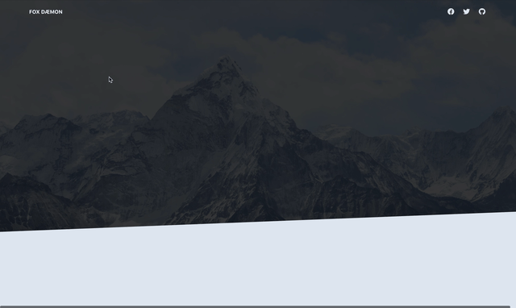

# Animated template

Given a template (from tailwinds) I animated some elements of the page on scroll by using a third-party library called [AOS](https://michalsnik.github.io/aos/). 

 

---

 

## Learning outcome

 

1. Importing and using a third-party library
2. Importance on how scripts are loaded (using `async` and `defer` attributes for `<script>`):
   -  We use `async` if we don't care about execution order or if the script does not depend on another script. 
   - We use `defer` at the **beginning** of the document, in the `<head>` element because we want to download the JS as soon as possible but we don't want it to be executed until all html is parsed  👉🏻 Use `defer` for scripts that have to be used once all html has been parsed
3. Animating elements on a page on **scroll**

 

---

 

## Process

This project was simple. I was using a landing template from tailwinds css and I followed the documentation of [AOS](https://michalsnik.github.io/aos/) library to add some smooth animations to some elements of the page.

 

---

 

- Icons from [Font Awesome](https://fontawesome.com/)

- Images from [Unsplash](https://unsplash.com/) 

- Template and CSS from [Tailwinds](https://tailwindcss.com/)
- User pictures from [Random user](https://randomuser.me/)
- Animations from [AOS library](https://michalsnik.github.io/aos/)

